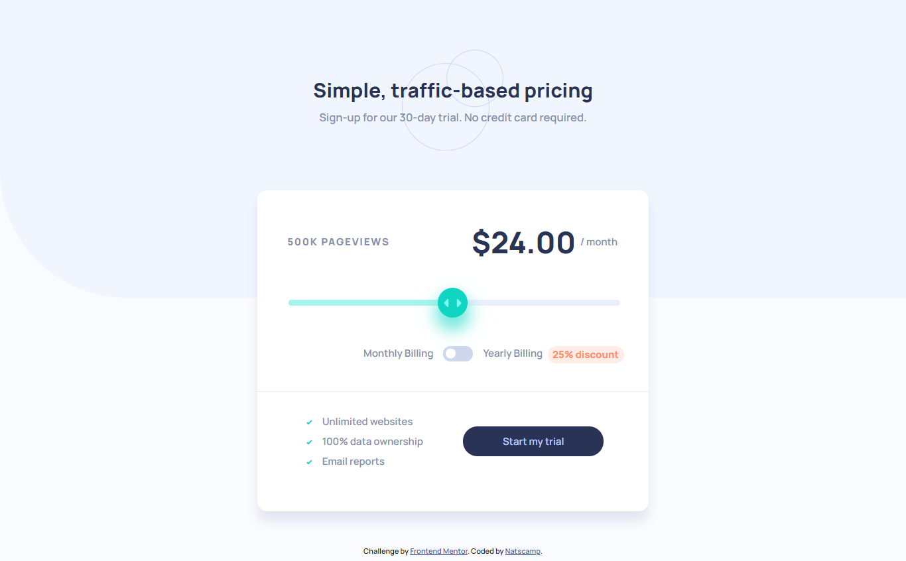

# Frontend Mentor - Interactive pricing component solution

This is a solution to the [Interactive pricing component challenge on Frontend Mentor](https://www.frontendmentor.io/challenges/interactive-pricing-component-t0m8PIyY8). Frontend Mentor challenges help you improve your coding skills by building realistic projects.

## Table of contents

-   [Overview](#overview)
    -   [The challenge](#the-challenge)
    -   [Screenshot](#screenshot)
    -   [Links](#links)
-   [My process](#my-process)
    -   [Built with](#built-with)
    -   [What I learned](#what-i-learned)
    -   [Useful resources](#useful-resources)
-   [Author](#author)

## Overview

### The challenge

Users should be able to:

-   View the optimal layout for the app depending on their device's screen size
-   See hover states for all interactive elements on the page
-   Use the slider and toggle to see prices for different page view numbers

### Screenshot



### Links

-   Solution URL: [Solution](https://www.frontendmentor.io/solutions/interactive-pricing-component-using-css-custom-properties-and-vuejs-2yTiBpbOL)
-   Live Site URL: [Live Demo](https://interactive-pricing-component-eta-nine.vercel.app/)

### Built with

-   CSS custom properties
-   Flexbox
-   CSS Grid
-   Mobile-first workflow
-   [Vue](https://vuejs.org/) - JavaScript Framework

### What I learned

-   HTML range elements can have different breakpoints specified on it. This can be acheived using the HTML datalist element.

    Here is how I used it in my solution:

```html
<input id="slider" type="range" min="10" max="1000" step="50" list="slider-list" />

<datalist id="slider-list">
	<option value="10"></option>
	<option value="50"></option>
	<option value="100"></option>
	<option value="500"></option>
	<option value="1000"></option>
</datalist>
```

-   There is a CSS at rule that allows styles to be applied only if it is supported on that browser. It is the @supports rule and it is useful for testing browser support before applying styles.

    This example show how it can be used to apply styles to the range element only if it is supported:

```css
@supports selector(::-webkit-slider-thumb) {
	input[type="range"]::-webkit-slider-thumb {
		-webkit-appearance: none;
}
```

### Useful resources

-   [How to create a custom Toggle Switch using CSS](https://dev.to/karankmr/how-to-create-a-custom-toggle-switch-using-css-4pmi) - This article by Karan Kumar explains how to create a custom toggle switch using only CSS. It makes use of the label element and checkbox input to acheive this effect.
-   [Styling Cross-Browser Compatible Range Inputs with CSS](https://css-tricks.com/styling-cross-browser-compatible-range-inputs-css/) - This article by Daniel Stern shows how to style a range input across different browsers. I used this article to style the slider that is compatible across browsers.

## Author

-   Github - [Nathan1434](https://github.com/Nathan1434)
-   Frontend Mentor - [@Nathan1434](https://www.frontendmentor.io/profile/Nathan1434)
-   Twitter - [@natscamp02](https://twitter.com/natscamp02)
